# RetailPulse Analytics Platform — Architecture

## Overview
End-to-end modern data platform built on Snowflake, dbt, Terraform, and GitHub Actions.

## Solution Architecture

```mermaid
flowchart LR
    subgraph SOURCES["📦 Data Sources"]
        A1[Retail Orders CSV]
        A2[Customer API]
        A3[Product Catalog]
    end

    subgraph INGEST["⚡ Ingestion Layer"]
        B1[AWS S3\nData Lake]
        B2[Snowpipe\nAuto-ingest]
    end

    subgraph SNOWFLAKE["❄️ Snowflake — Medallion Architecture"]
        subgraph BRONZE["🟫 BRONZE — RAW_DB"]
            C1[raw_orders]
            C2[raw_customers]
            C3[raw_products]
        end
        subgraph SILVER["⬜ SILVER — DEV_DB"]
            D1[stg_orders]
            D2[stg_customers]
            D3[stg_products]
        end
        subgraph GOLD["🟡 GOLD — DEV_DB"]
            E1[fct_orders]
            E2[dim_customers]
            E3[dim_products]
            E4[dim_date]
        end
        subgraph SEMANTIC["🔷 SEMANTIC LAYER"]
            F1[metric: total_revenue]
            F2[metric: order_count]
            F3[metric: customer_ltv]
        end
    end

    subgraph REPORTING["📊 Reporting"]
        G1[Streamlit Dashboard]
        G2[Claude AI NLP Query]
    end

    subgraph EXPORT["📤 Export"]
        H1[AWS S3 Unload\nvia dbt macro]
    end

    A1 --> B1
    A2 --> B1
    A3 --> B1
    B1 --> B2 --> BRONZE
    BRONZE --> SILVER
    SILVER --> GOLD
    GOLD --> SEMANTIC
    SEMANTIC --> G1
    SEMANTIC --> G2
    GOLD --> H1
```



## Medallion Layers

| Layer | Database | Purpose | Materialization |
|-------|----------|---------|-----------------|
| Bronze | RAW_DB | Raw, as-is from source | Table (append) |
| Silver | DEV_DB.SILVER | Cleaned, typed, deduped | Incremental |
| Gold | DEV_DB.GOLD | Business facts & dims | Table |
| Semantic | DEV_DB.SEMANTIC | KPIs via MetricFlow | View/Metric |

## Infrastructure Managed by Terraform

- **Warehouses:** INGEST_WH (XS), TRANSFORM_WH (S), REPORTING_WH (XS)
- **Roles:** RAW_LOADER, DBT_ROLE, ANALYST_ROLE, SYSADMIN
- **Users:** dbt_svc_user, fivetran_svc_user, loader_svc_user
- **Databases:** RAW_DB, DEV_DB, PROD_DB
- **Schemas:** BRONZE, SILVER, GOLD, SEMANTIC

## CI/CD Flow

```
feature/xyz  →  dev        →  main
     ↓              ↓              ↓
  dbt test      dbt test      dbt build
  (changed      (all)         --target prod
   models)
```